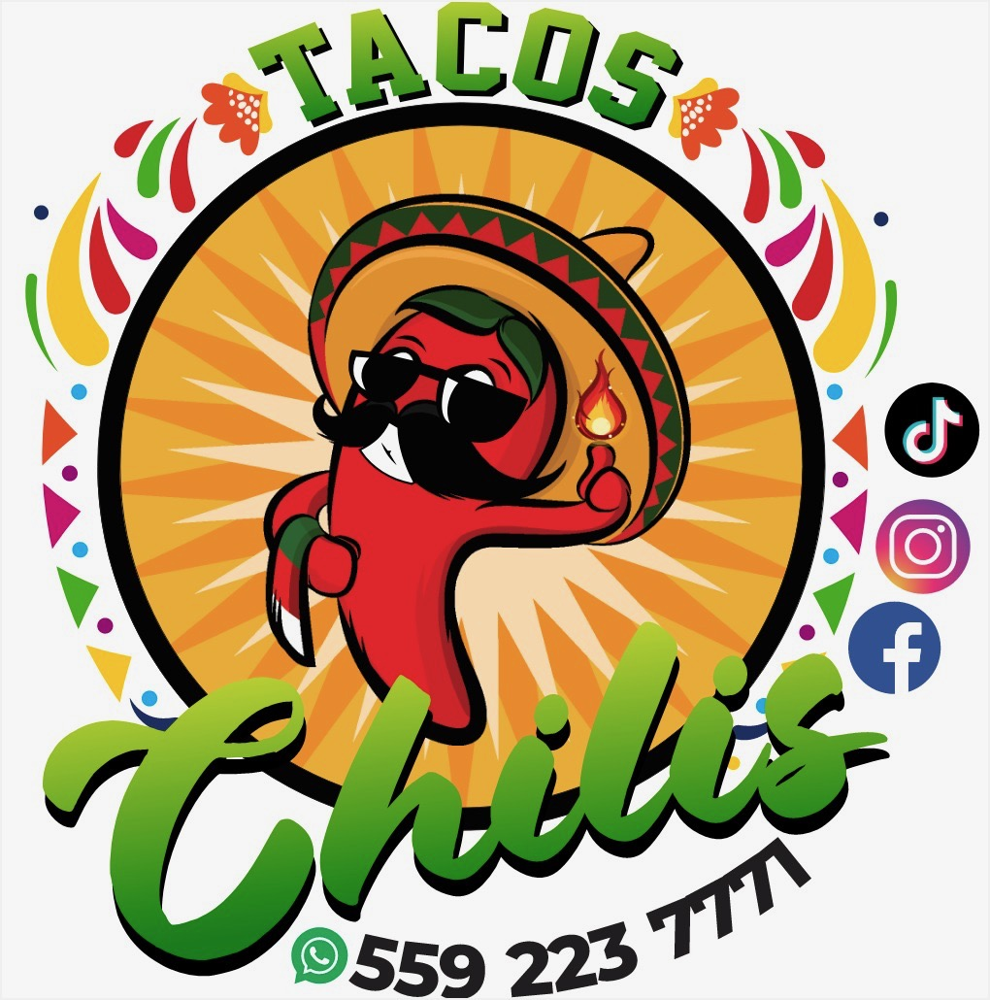

# Tacos Chilis Menu - Improvements Plan 📋

This document outlines proposed improvements to the online menu, including implementation approaches and rationale for each enhancement.

---

## Table of Contents

1. [Critical Fixes](#critical-fixes)
2. [Functionality Improvements](#functionality-improvements)
3. [Performance Optimizations](#performance-optimizations)
4. [Accessibility Enhancements](#accessibility-enhancements)
5. [SEO & Social Sharing](#seo--social-sharing)
6. [User Experience Enhancements](#user-experience-enhancements)
7. [Code Quality Improvements](#code-quality-improvements)
8. [Security & Best Practices](#security--best-practices)
9. [Analytics & Tracking](#analytics--tracking)
10. [Visual Polish](#visual-polish)

---

## Critical Fixes

### 1. Logo Path Mismatch [Done]

**What:** Fix broken logo image reference  
**How:** Update `index.html` line 17 from `img/logo.jpg` to `img/logo.jpeg`  
**Why:** The logo currently fails to load because the file was renamed. This breaks the visual identity and refresh button functionality.

**Implementation:**

```html
<!-- Change from: -->


<!-- To: -->

```

**Priority:** 🔴 Critical - Must fix immediately

---

## Functionality Improvements

### 2. Image Loading Error Handling [Done]

**What:** Add fallback images when menu images fail to load  
**How:** Add `onerror` handlers to all `` tags that replace the broken image with the placeholder  
**Why:** Prevents broken image icons from appearing if external image URLs become unavailable, maintaining a professional appearance.

**Implementation:**

```javascript
// In renderMenu() function, modify image tags:
html += ``;
```

**Priority:** 🟡 High - Improves reliability

### 3. Enhanced CSV Error Handling [Done]

**What:** Better error messages and retry functionality for failed menu loads  
**How:**

- Replace generic error message with user-friendly text
- Add a "Retry" button in error state
- Show specific error types (network vs. parsing)

**Why:** Users currently see a generic red error with no recovery path. Better messaging and retry options improve user experience during network issues.

**Implementation:**

```javascript
error: function(error) {
    menuContainer.innerHTML = `
        <div class="error-state">
            <p>Unable to load menu. Please check your connection.</p>
            <button onclick="loadMenuData()" class="retry-btn">Retry</button>
        </div>
    `;
}
```

**Priority:** 🟡 High - Improves user experience during failures

---

## Performance Optimizations

### 4. Image Optimization Strategy [Reverted - Manual Approach]

**What:** Optimize images for faster loading  
**Status:** Code was implemented but reverted. User will handle WebP conversion manually and use WebP URLs directly in CSV.

**Current Implementation:**

- Images load directly from URLs in CSV (no automatic conversion)
- Error handling with placeholder fallback remains
- User converts images to WebP and uses WebP URLs in spreadsheet

**Why:** WebP images are 25-35% smaller than JPEG, reducing load times and data usage, especially important for mobile users. Manual approach gives user full control over image optimization.

**Implementation:**

```html
<picture>
  <source srcset="image.webp" type="image/webp" />
  
</picture>
```

**Priority:** 🟢 Medium - Performance boost, especially on mobile

### 5. Service Worker for Offline Support [Done]

**What:** Cache menu data and assets for offline viewing  
**How:**

- Create `sw.js` service worker file
- Cache CSV data, images, and static assets
- Implement cache-first strategy with network fallback
- Handles Google Sheets CSV with cacheBust parameter
- Automatic cache updates and version management

**Why:** Allows customers to view the menu even with poor connectivity. Improves perceived performance on repeat visits.

**Implementation:**

```javascript
// sw.js - Cache menu data and assets
self.addEventListener("install", (event) => {
  event.waitUntil(
    caches.open("menu-v1").then((cache) => {
      return cache.addAll([
        "/",
        "/style.css",
        "/main.js",
        // Cache menu CSV
      ]);
    })
  );
});
```

**Priority:** 🟢 Medium - Nice-to-have feature

---

## Accessibility Enhancements

### 6. ARIA Labels and Semantic HTML [Done]

**What:** Improve screen reader support and keyboard navigation  
**How:**

- Add `aria-label` to refresh button
- Add `aria-live="polite"` to menu container for dynamic updates
- Ensure all interactive elements are keyboard accessible
- Add skip-to-content link
- Add ARIA labels to address and phone links

**Why:** Makes the menu usable for people with disabilities, improves SEO, and ensures legal compliance with accessibility standards (ADA, WCAG).

**Implementation:**

```html
<button
  id="refreshMenuBtn"
  aria-label="Refresh menu to get latest items"
  title="Refresh menu"
>
  <!-- logo image -->
</button>

<a href="#menu" class="skip-link">Skip to menu</a>
```

**Priority:** 🟡 High - Legal compliance and inclusivity

### 7. Keyboard Navigation Improvements [Done]

**What:** Ensure all interactive elements are keyboard accessible  
**How:**

- Add visible focus indicators
- Ensure tab order is logical
- Add keyboard shortcuts (e.g., 'R' to refresh)
- Smooth scroll behavior for skip links

**Why:** Many users navigate with keyboards. Missing focus styles make navigation difficult or impossible.

**Implementation:**

```css
button:focus-visible,
a:focus-visible {
  outline: 3px solid var(--accent);
  outline-offset: 2px;
}
```

**Priority:** 🟡 High - Accessibility requirement

### 8. Color Contrast Verification

**What:** Audit and fix color contrast ratios  
**How:**

- Use tools like WebAIM Contrast Checker
- Adjust colors to meet WCAG AA standards (4.5:1 for text)
- Test with color blindness simulators

**Why:** Low contrast makes text unreadable for many users, especially those with visual impairments.

**Priority:** 🟡 High - Accessibility requirement

---

## SEO & Social Sharing

### 9. Meta Tags and Open Graph

**What:** Add comprehensive meta tags for SEO and social sharing  
**How:** Add to `<head>` section:

- Meta description
- Open Graph tags (Facebook, LinkedIn)
- Twitter Card tags
- Canonical URL

**Why:** Improves search engine rankings and makes shared links look professional on social media platforms.

**Implementation:**

```html
<meta
  name="description"
  content="Tacos Chilis - Authentic Mexican street tacos in Chowchilla, CA. View our full menu online."
/>
<meta property="og:title" content="Tacos Chilis Menu" />
<meta
  property="og:description"
  content="Authentic Mexican street tacos in Chowchilla, CA"
/>
<meta property="og:image" content="https://yoursite.com/img/logo.jpeg" />
<meta name="twitter:card" content="summary_large_image" />
```

**Priority:** 🟢 Medium - Improves discoverability

### 10. Structured Data (JSON-LD)

**What:** Add schema.org markup for local business  
**How:** Add JSON-LD script in `<head>` with LocalBusiness schema including:

- Business name, address, phone
- Opening hours
- Menu URL
- Price range

**Why:** Enables rich snippets in Google search results (shows hours, ratings, etc.) and improves local SEO.

**Implementation:**

```html
<script type="application/ld+json">
  {
    "@context": "https://schema.org",
    "@type": "Restaurant",
    "name": "Tacos Chilis",
    "address": {
      "@type": "PostalAddress",
      "streetAddress": "23706 Robertson Blvd",
      "addressLocality": "Chowchilla",
      "addressRegion": "CA",
      "postalCode": "93610"
    },
    "telephone": "+15592237771"
  }
</script>
```

**Priority:** 🟢 Medium - SEO benefit

### 11. Favicon

**What:** Add favicon and app icons  
**How:**

- Create favicon.ico (16x16, 32x32)
- Add apple-touch-icon for iOS
- Add manifest.json for PWA support

**Why:** Professional appearance in browser tabs and when saved to home screen on mobile devices.

**Priority:** 🟢 Low - Visual polish

---

## User Experience Enhancements

### 12. Loading Progress Indicator

**What:** Show loading progress during CSV fetch  
**How:**

- Add progress bar or spinner during data fetch
- Show "Loading menu..." message
- Keep skeleton loader but add percentage if possible

**Why:** Provides feedback that the system is working, reducing perceived wait time and user anxiety.

**Priority:** 🟢 Medium - UX improvement

### 13. Mobile-Specific Enhancements

**What:** Optimize for mobile users  
**How:**

- Add sticky "Call Now" button on mobile
- Ensure touch targets are at least 44x44px
- Add swipe gestures for announcements ribbon
- Consider bottom navigation for categories

**Why:** Many users will view menu on mobile. Mobile-optimized features improve conversion (calls, visits).

**Implementation:**

```css
@media (max-width: 768px) {
  .call-now-btn {
    position: fixed;
    bottom: 20px;
    right: 20px;
    z-index: 1000;
    background: var(--accent-2);
    color: white;
    padding: 12px 24px;
    border-radius: 50px;
    box-shadow: 0 4px 12px rgba(0, 0, 0, 0.3);
  }
}
```

**Priority:** 🟡 High - Mobile is primary use case

### 14. Print Stylesheet

**What:** Add print-optimized CSS  
**How:** Create `@media print` rules:

- Hide navigation, buttons, ribbons
- Optimize layout for paper
- Remove backgrounds, adjust colors
- Add page breaks appropriately

**Why:** Customers may want to print the menu. Print styles ensure it looks professional on paper.

**Priority:** 🟢 Low - Nice-to-have feature

### 15. Menu Search/Filter

**What:** Add search functionality to filter menu items  
**How:**

- Add search input above menu
- Filter items by name, description, or category
- Highlight matching text
- Show "No results" message

**Why:** Large menus are hard to navigate. Search helps users quickly find specific items.

**Implementation:**

```javascript
function setupSearch() {
  const searchInput = document.createElement("input");
  searchInput.type = "search";
  searchInput.placeholder = "Search menu...";
  searchInput.addEventListener("input", (e) => {
    filterMenuItems(e.target.value);
  });
  menuContainer.insertBefore(searchInput, menuContainer.firstChild);
}
```

**Priority:** 🟢 Medium - Useful for large menus

### 16. Category Jump Links

**What:** Add navigation links to jump to categories  
**How:**

- Create sticky category navigation bar
- Smooth scroll to sections
- Highlight active category on scroll

**Why:** Makes navigation easier on long menus, especially on mobile.

**Priority:** 🟢 Medium - UX improvement

### 17. Last Updated Timestamp

**What:** Display when menu was last updated  
**How:**

- Parse CSV header or add timestamp to sheet
- Display in header or footer
- Update on each successful load

**Why:** Customers want to know if menu is current. Builds trust and reduces confusion.

**Priority:** 🟢 Low - Informational feature

---

## Code Quality Improvements

### 18. Extract Magic Numbers

**What:** Replace hardcoded values with named constants  
**How:** Move all magic numbers to configuration object:

- Announcement rotation interval (3000ms)
- Resize debounce delay (150ms)
- Desktop breakpoint (769px)

**Why:** Makes code more maintainable and easier to adjust. Self-documenting code.

**Implementation:**

```javascript
const CONFIG = {
  ANNOUNCEMENT_INTERVAL: 3000,
  RESIZE_DEBOUNCE: 150,
  DESKTOP_BREAKPOINT: 769,
  CACHE_DURATION: 5 * 60 * 1000, // 5 minutes
};
```

**Priority:** 🟢 Low - Code maintainability

### 19. Add JSDoc Comments

**What:** Document all functions with JSDoc  
**How:** Add comments above each function describing:

- Purpose
- Parameters
- Return values
- Side effects

**Why:** Improves code readability and makes maintenance easier for future developers.

**Implementation:**

```javascript
/**
 * Processes raw CSV data into structured menu categories
 * @param {Array<Object>} data - Raw CSV rows from Papa.parse
 * @returns {Object} Object containing categories and announcements
 */
function processData(data) {
  // ...
}
```

**Priority:** 🟢 Low - Documentation

### 20. Improved Error Handling with Fetch

**What:** Use native fetch API with better error handling  
**How:**

- Replace Papa.parse direct URL with fetch + response handling
- Add timeout handling
- Better error messages based on status codes

**Why:** More control over network requests, better error handling, and modern JavaScript practices.

**Priority:** 🟢 Low - Code modernization

---

## Security & Best Practices

### 21. Input Sanitization

**What:** Enhanced validation of CSV data  
**How:**

- Validate all user-provided data from CSV
- Sanitize HTML more thoroughly
- Limit string lengths
- Validate image URLs

**Why:** Prevents XSS attacks and ensures data integrity. Critical if CSV is editable by multiple users.

**Priority:** 🟡 High - Security best practice

### 22. Content Security Policy

**What:** Add CSP headers to prevent XSS  
**How:**

- Add meta tag or server headers
- Whitelist allowed sources (Google Sheets, CDNs)
- Restrict inline scripts/styles

**Why:** Defense-in-depth security measure against injection attacks.

**Priority:** 🟢 Medium - Security hardening

---

## Analytics & Tracking

### 23. Analytics Integration

**What:** Add analytics to track usage  
**How:**

- Add Google Analytics 4 or similar
- Track page views, menu refreshes
- Track which categories are viewed most
- Monitor error rates

**Why:** Data-driven decisions. Understand user behavior to improve menu organization and features.

**Priority:** 🟢 Medium - Business intelligence

### 24. Performance Monitoring

**What:** Track performance metrics  
**How:**

- Use Web Vitals API
- Log load times
- Monitor image load failures
- Track CSV fetch duration

**Why:** Identify performance bottlenecks and optimize based on real user data.

**Priority:** 🟢 Low - Performance optimization

---

## Visual Polish

### 25. Enhanced Hover Effects

**What:** Improve interactive feedback  
**How:**

- Add subtle hover effect to logo/refresh button
- Improve card hover transitions
- Add loading spinner on refresh

**Why:** Better visual feedback makes the interface feel more responsive and polished.

**Priority:** 🟢 Low - Visual polish

### 26. Smooth Scroll Behavior

**What:** Add smooth scrolling for anchor links  
**How:** Add CSS:

```css
html {
  scroll-behavior: smooth;
}
```

**Why:** Better user experience when navigating to sections.

**Priority:** 🟢 Low - UX polish

### 27. Browser Compatibility

**What:** Ensure cross-browser compatibility  
**How:**

- Test `aspect-ratio` CSS (add fallback padding-bottom hack)
- Test `backdrop-filter` (add fallback background)
- Test on older browsers if needed

**Why:** Ensures menu works for all users regardless of browser choice.

**Priority:** 🟡 High - Compatibility requirement

---

## Implementation Status Summary

### ✅ Completed (7/27 improvements - 26%)

1. ✅ **Logo Path Mismatch** - Fixed broken logo reference
2. ✅ **Image Loading Error Handling** - Added fallback placeholder images
3. ✅ **Enhanced CSV Error Handling** - User-friendly errors with retry button
4. ✅ **Service Worker for Offline Support** - Caching with stale-while-revalidate strategy
5. ✅ **Update Notification System** - Visual notification when menu updates (bonus feature)
6. ✅ **ARIA Labels and Semantic HTML** - Full screen reader support
7. ✅ **Keyboard Navigation Improvements** - Focus indicators and shortcuts

### 🔄 In Progress / Modified

4. 🔄 **Image Optimization** - Reverted to manual approach (user handles WebP conversion)

### 📋 Remaining High Priority

8. **Color Contrast Verification** - Audit and fix contrast ratios (WCAG AA compliance)
9. **Mobile-Specific Enhancements** - Sticky call button, touch targets, swipe gestures
10. **Input Sanitization** - Enhanced validation of CSV data

### 📋 Remaining Medium Priority

11. **SEO & Social Sharing Meta Tags** - Open Graph, Twitter Cards, descriptions
12. **Structured Data (JSON-LD)** - Schema.org markup for local business
13. **Loading Progress Indicator** - Show progress during CSV fetch
14. **Menu Search/Filter** - Search functionality for menu items
15. **Category Jump Links** - Navigation to jump to categories
16. **Analytics Integration** - Track usage and performance

### 📋 Remaining Low Priority

17. **Print Stylesheet** - Print-optimized CSS
18. **Last Updated Timestamp** - Display when menu was last updated
19. **Code Quality Improvements** - JSDoc comments, extract constants
20. **Visual Polish Enhancements** - Enhanced hover effects, smooth scroll
21. **Favicon and PWA Support** - App icons and manifest
22. **Browser Compatibility** - Test and add fallbacks for older browsers

---

## Estimated Impact

| Category       | Impact | Effort | ROI        |
| -------------- | ------ | ------ | ---------- |
| Critical Fixes | High   | Low    | ⭐⭐⭐⭐⭐ |
| Accessibility  | High   | Medium | ⭐⭐⭐⭐⭐ |
| Mobile UX      | High   | Medium | ⭐⭐⭐⭐   |
| Performance    | Medium | High   | ⭐⭐⭐     |
| SEO            | Medium | Low    | ⭐⭐⭐⭐   |
| Code Quality   | Low    | Medium | ⭐⭐       |

---

## Implementation Notes

### Testing Requirements

- All improvements should be tested on multiple devices and browsers
- Test service worker functionality (offline mode, cache updates)
- Verify accessibility with screen readers (NVDA, JAWS, VoiceOver)
- Test keyboard navigation on all interactive elements
- Verify error states work correctly

### Best Practices

- Keep backup of current working version before major changes
- Test with real Google Sheets data to ensure compatibility
- Monitor service worker cache behavior in production
- Consider A/B testing for UX changes
- Monitor analytics after implementing changes

### Known Issues / Decisions

- **WebP Optimization**: Reverted automatic conversion. User will manually convert images to WebP and use WebP URLs directly in CSV spreadsheet.
- **Service Worker**: Uses stale-while-revalidate strategy for CSV - serves cache immediately, updates in background
- **Update Notifications**: Auto-dismiss after 10 seconds, can be manually dismissed

---

## Progress Summary

**Overall Progress:** 7 of 27 improvements completed (26%)

**Completed Categories:**

- ✅ Critical Fixes (1/1)
- ✅ Functionality Improvements (2/2)
- ✅ Performance Optimizations (1/2 - Service Worker done, WebP manual)
- ✅ Accessibility Enhancements (2/3 - ARIA & Keyboard done, Color Contrast pending)

**Key Achievements:**

- Menu now works offline with service worker caching
- Full keyboard and screen reader accessibility
- Robust error handling with user-friendly messages
- Automatic update notifications when menu changes
- All images have fallback handling

**Next Steps:**

1. Color contrast audit (accessibility compliance)
2. Mobile enhancements (sticky call button, touch optimization)
3. SEO improvements (meta tags, structured data)
4. User experience features (search, category navigation)

---

**Last Updated:** December 2024  
**Status:** In Progress - 26% Complete
